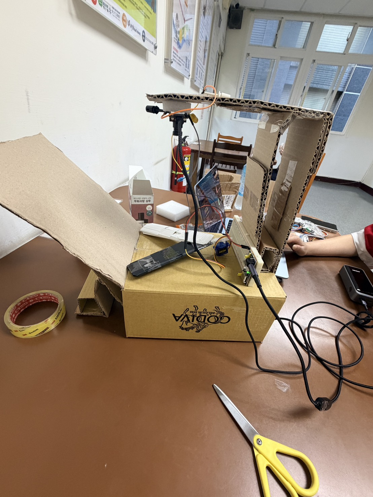
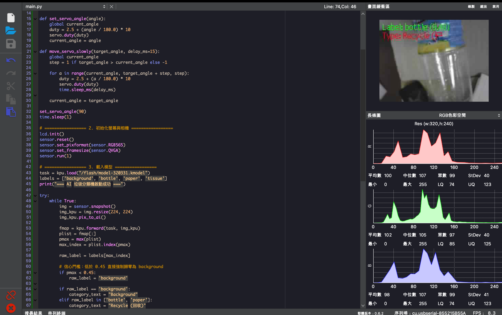
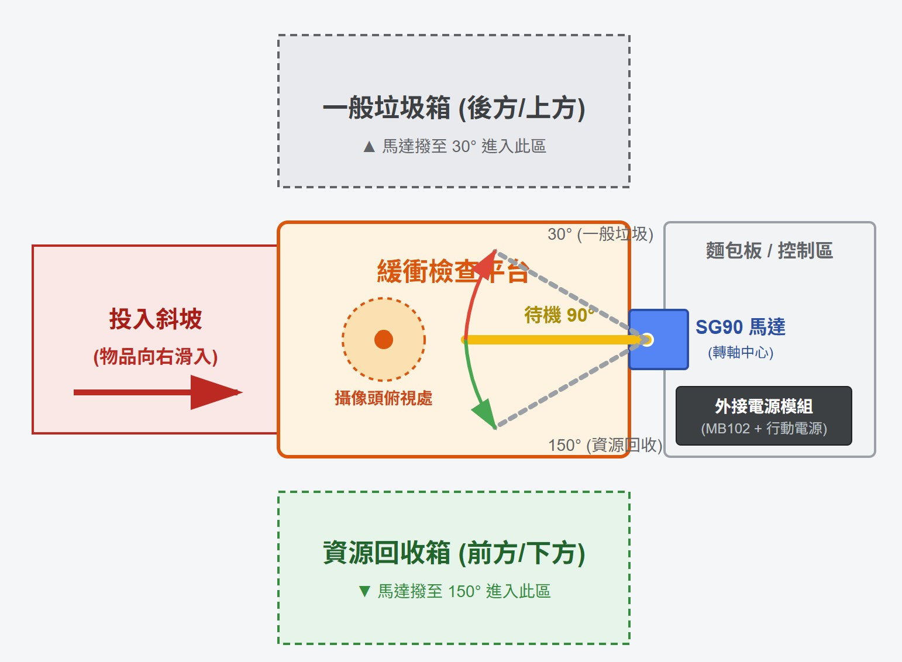
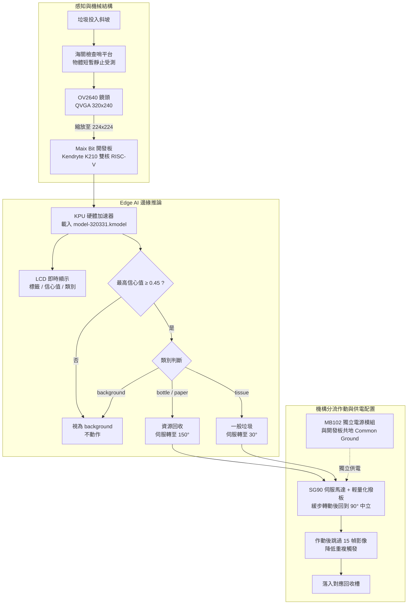

# AI 智慧垃圾分類機 (AI-Powered Waste Sorting Machine)

基於 Sipeed Maix Bit（Kendryte K210）打造的邊緣 AI 垃圾分類機。垃圾滑入斜坡後在「檢查哨平台」短暫靜止，鏡頭擷取影像交給 K210 內建的 KPU 神經網路加速器辨識，判斷為回收物或一般垃圾後，由 SG90 伺服馬達撥板推入對應回收槽。整個流程在板端離線完成，不需連網。

## 成果展示

| 完成品 | LCD 辨識畫面 |
| :---: | :---: |
|  |  |



- 🎬 [辨別出是資源回收.mp4](成果展示/辨別出是資源回收.mp4)
- 🎬 [辨別出是一般垃圾.mp4](成果展示/辨別出是一般垃圾.mp4)
- 📈 [MaixHub 訓練結果](成果展示/MaixHub訓練結果.jpg)

## 研究動機

在台北，落實垃圾分類是每天的生活日常。追垃圾車時只要稍有疏忽，把塑膠瓶、紙容器混進一般垃圾，就可能被清潔隊員糾正。本專案希望在丟垃圾的瞬間就把分類做好，讓人不必再手動挑揀。

## 系統架構



## 辨識類別與分流規則

| 模型類別 | 說明 | 分類結果 | 伺服角度 |
| :--- | :--- | :--- | :---: |
| `bottle` | 寶特瓶 | 資源回收 | 150° |
| `paper` | 紙類 | 資源回收 | 150° |
| `tissue` | 衛生紙 | 一般垃圾 | 30° |
| `background` | 空平台 / 背景 | 不動作 | 維持 90° |

最高信心值低於 **0.45** 時，一律視為 `background`，降低光影或雜物造成誤撥的機會。

## 硬體規格

| 項目 | 規格 |
| :--- | :--- |
| 開發板 | Sipeed Maix Bit（MaixPy / MicroPython 韌體） |
| 主控晶片 | Kendryte K210，雙核 64-bit RISC-V @ 400MHz，內建 KPU |
| 鏡頭 | OV2640，QVGA 320x240 RGB565 |
| 顯示 | 2.4 吋 ST7789 TFT LCD |
| 致動器 | SG90 伺服馬達，Pin 9 輸出 50Hz PWM |
| 電源 | MB102 麵包板獨立電源模組，與開發板共地 |
| 儲存 | 板載 16MB SPI Flash，模型與資料集照片皆存於 `/flash/` |

## 模型訓練

模型於 [MaixHub](https://maixhub.com) 以遷移學習方式訓練（Training ID 320331），主幹網路選用 `mobilenet_0.5` 輕量化主幹網路，以配合 K210 的記憶體與算力限制。

| 項目 | 數值 |
| :--- | :--- |
| 資料集總數 | 150 張（bottle 45、paper 45、tissue 30、background 30） |
| 訓練 / 驗證 | 130 / 20（驗證切分設定 10%，每類驗證影像至少 5 張） |
| 訓練集分布 | background 25、bottle 40、paper 40、tissue 25 |
| 驗證集分布 | 四類各 5 張 |
| 輸入尺寸 | 224 x 224 RGB 三通道（resize method: contain） |
| 資料增強 | Mirror、Rotation、Blur |
| Epochs / Batch size / 最大學習率 | 100 / 8 / 0.001 |
| 驗證結果 | 第 100 個 epoch：val_loss 0.1477、val_acc 1.0，平台選取該 epoch 匯出模型 |

本次訓練使用 130 張訓練影像與 20 張驗證影像，驗證集四類各 5 張。第 100 個 epoch 的驗證準確率為 100%。由於驗證樣本有限，此結果僅代表該次驗證集上的表現，不能直接代表不同環境下的辨識效果或實際機台分流成功率。

> 註：MaixHub 頁面摘要顯示訓練／驗證為 135／15，但訓練 log 記錄實際切分並載入的數量為 130／20，本文以執行紀錄為準。

資料集照片全部由開發板鏡頭直接拍攝（`bottle.py`、`paper.py`、`tissue.py`、`camera.py`），每批 15 張存到板載 Flash 後再下載到電腦，使訓練資料與實際部署環境的視角、光線、鏡頭特性盡量一致。repo 內 `trashdataset/` 為其中 95 張範例，完整資料集在 MaixHub 專案內。

## 模型部署

Maix Bit 的 MicroSD 卡槽故障，且 IDE 傳輸大檔時經常逾時或溢位，因此自行撰寫 `tools/flash_model.py`：透過序列埠與 MicroPython REPL 交談，把 `.kmodel` 切成 120 bytes 區塊以 Base64 編碼傳送，板端即時解碼並以 append 模式寫入 `/flash/model-320331.kmodel`，每 30 個區塊主動 `gc.collect()` 一次。

```bash
pip install pyserial
# 修改 tools/flash_model.py 內的 COM_PORT 與 KMODEL_PATH 後執行
python tools/flash_model.py
```

## 快速開始

1. 燒錄 MaixPy 韌體至 Maix Bit。
2. 依上節將 `model-320331.kmodel` 寫入 `/flash/`。
3. 將 `main.py` 上傳為 `/flash/main.py`，開機即自動執行。
4. 伺服馬達訊號線接 Pin 9，電源接 MB102 模組，並將 MB102 的 GND 與開發板 GND 相接。

## 專案結構

```
.
├── main.py                 # 主程式：辨識 + 伺服分流
├── camera.py               # 資料收集：background 類別
├── bottle.py               # 資料收集：bottle 類別
├── paper.py                # 資料收集：paper 類別
├── tissue.py               # 資料收集：tissue 類別
├── testColor.py            # 早期版本：RGB 中心像素判色（已被 AI 版取代）
├── tools/flash_model.py    # 序列埠 Base64 分塊燒錄模型
├── trashdataset/           # 部分訓練照片（320x240）
├── docs/                   # 專案介紹（PORTFOLIO.md）
└── 成果展示/                # 照片與操作影片
```

## 技術亮點

- **Edge AI 完全離線推論**：模型以 KPU 硬體加速，不依賴雲端 API。
- **背景負樣本 + 信心門檻雙重過濾**：訓練時加入 `background` 類別，推論時再以 0.45 門檻攔截低信心結果。
- **自創「海關檢查哨」機構**：捨棄自由落體，讓物體在辨識區域短暫靜止，提供較穩定的影像擷取條件。
- **伺服緩步轉動**：以逐度更新角度的方式控制伺服馬達，搭配 MB102 外部供電並與開發板共地，期望減輕快速作動造成的供電衝擊。
- **降低重複觸發**：作動後跳過 15 幀影像，降低短時間內重複觸發的機會。
- **LCD 即時回饋**：畫面直接疊加標籤、信心值與分類結果，方便現場除錯與展示。

## 克服的挑戰

1. **模型部署與記憶體瓶頸**：MicroSD 卡槽故障加上 IDE 序列埠傳輸溢位，改以自製 Base64 分塊串流搭配主動 GC 寫入板載 Flash。
2. **硬體供電問題**：開發初期曾在馬達作動時發生 USB 斷線，懷疑與供電不足或瞬間負載有關，因此改由 MB102 外部電源供電並與開發板共地，軟體端同時改為緩步轉動。
3. **動態辨識的物理限制**：物體掉落過快，難以擷取清晰且穩定的影像，重新設計 Y 字型滑梯加入緩衝坡與停止檔板，讓物體在辨識區域短暫靜止。
4. **從色彩感測到 AI**：`testColor.py` 的 RGB 判色容易受反光與陰影干擾，改為收集實物照片訓練神經網路，並加入背景類別與信心門檻。

## 已知限制與未來方向

- 資料集僅 150 張、且在單一場地拍攝，尚缺乏跨場景驗證，換環境或光源可能需要重新收集資料。
- 目前只支援三種垃圾，未涵蓋鐵鋁罐、玻璃等類別。
- 撥板一次只能處理一件物品，多件同時投入會互相干擾。
