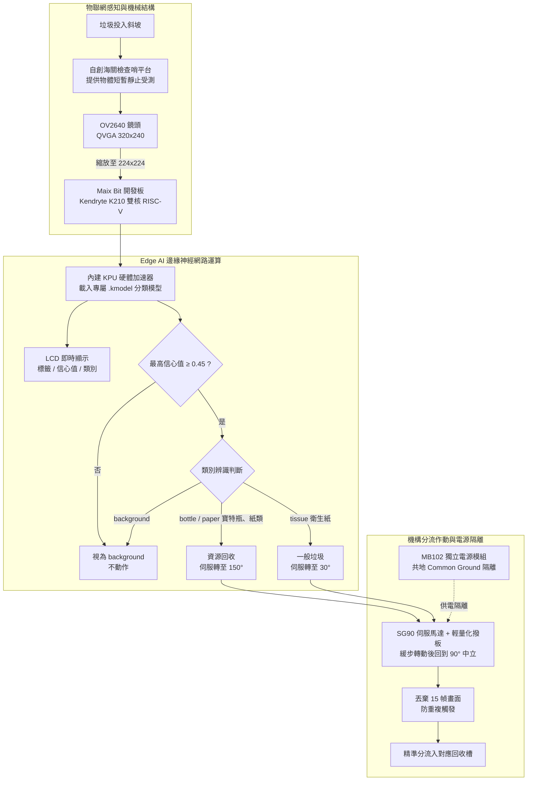

## 專案一 AI 智慧垃圾分類機 (AI-Powered Waste Sorting Machine)
* [開源程式碼連結](https://github.com/peiying004/recycle)
### 成果展示
| 完成品 | LCD 辨識畫面 |
| :---: | :---: |
|  |  |

* 🎬 [操作影片：辨別出是資源回收](https://github.com/peiying004/recycle/blob/master/%E6%88%90%E6%9E%9C%E5%B1%95%E7%A4%BA/%E8%BE%A8%E5%88%A5%E5%87%BA%E6%98%AF%E8%B3%87%E6%BA%90%E5%9B%9E%E6%94%B6.mp4)
* 🎬 [操作影片：辨別出是一般垃圾](https://github.com/peiying004/recycle/blob/master/%E6%88%90%E6%9E%9C%E5%B1%95%E7%A4%BA/%E8%BE%A8%E5%88%A5%E5%87%BA%E6%98%AF%E4%B8%80%E8%88%AC%E5%9E%83%E5%9C%BE.mp4)

### 系統控制與機電分流架構圖 (Mermaid 架構圖)

* 專案簡介
本專案是一款基於 Maix Bit 開發板打造的「AI 智慧垃圾分類機」。有別於傳統單一的感測器，本系統採用邊緣人工智慧（Edge AI）視覺辨識技術。當垃圾進入坡道並停留在「檢查台」時，系統會透過鏡頭捕捉影像並交由 K210 內建的 KPU 進行神經網路運算，判別物品屬於寶特瓶、紙類、衛生紙或空背景四類，再依規則分流：寶特瓶與紙類歸資源回收，衛生紙歸一般垃圾，隨後驅動伺服馬達撥板，將垃圾自動推入對應的回收桶中。全程在板端離線完成，不需連網。
* 研究動機
在台北，嚴格落實垃圾分類是每天的生活日常。然而，在追垃圾車或倒垃圾時，只要稍有疏忽將資源回收物（如塑膠瓶、紙容器）混入一般垃圾中，往往會面臨被清潔隊員糾正甚至挨罵的尷尬場面。為了解決這個生活痛點，本專案期望透過 AI 視覺與自動化技術，在丟棄垃圾的瞬間把分類動作自動做好，徹底告別人工挑揀的麻煩與倒垃圾時的心理壓力。
* 使用技術亮點
    * Edge AI 視覺辨識與模型輕量化：利用 Maix Bit 內建的 KPU（神經網路加速器），以開發板鏡頭直接拍攝 150 張實境照片（寶特瓶 45、紙類 45、衛生紙 30、背景 30）建立 Dataset，在 MaixHub 以遷移學習訓練專屬 .kmodel 模型（100 epochs，驗證準確率 100%）。為符合硬體效能極限，將主幹網路替換為 mobilenet_0.25 進行壓縮，輸入尺寸 224x224，實現高速且脫機的物件分類。
    * 背景負樣本與信心門檻雙重過濾：訓練時刻意加入「background（空平台）」類別作為負樣本，推論時再以 0.45 的信心門檻攔截低信心結果，兩層機制讓平台淨空或光影變化時馬達不會誤動作。
    * 機電整合與機構設計：捨棄傳統的自由落體設計，自創「海關檢查哨」平台結構，為 AI 運算爭取穩定的判斷時間；並透過 SG90 伺服馬達配合輕量化撥板，以 150° / 30° 兩個角度分流，撥動後自動回到 90° 中立位置。
    * 穩定的共地供電架構：導入 MB102 麵包板獨立電源模組，將主機板（訊號控制）與伺服馬達（高耗電負載）的電源徹底分離；軟體端同時採用逐度緩步轉動取代瞬間跳轉，降低瞬間抽載，確保系統長時間運作的穩定性。
    * 防重複觸發與即時回饋：每次撥動完成後丟棄 15 幀殘影，避免同一物體被撥兩次；板載 LCD 即時疊加標籤、信心值與分類結果，方便現場除錯與展示。
* 克服的挑戰
    * 模型部署與記憶體傳輸瓶頸：開發期間 Maix Bit 的 MicroSD 卡槽故障，IDE 透過序列埠傳輸模型檔時又頻繁逾時、緩衝區溢位。最終自行撰寫 Python 燒錄腳本，透過序列埠與 MicroPython REPL 直接交談，把模型切成 120 bytes 區塊以 Base64 編碼串流傳送，板端即時解碼寫入板載 Flash，並每 30 個區塊主動觸發 gc.collect() 回收記憶體，成功繞過硬體故障與記憶體極限。
    * 硬體供電衝突：開發初期面臨馬達轉動瞬間抽載，導致電腦 USB 啟動過載保護而頻繁斷線。最終透過外接獨立變壓器，並運用電子學中的「共地 (Common Ground)」原理，搭配軟體緩步轉動，解決訊號干擾與供電問題。
    * 動態辨識的物理限制：垃圾掉落速度過快會導致相機無法對焦與辨識。透過重新設計 Y 字型滑梯機構，加入「緩衝坡與停止檔板」，讓物體靜止受測後再由馬達撥出，大幅提升了系統的辨識成功率。
    * 從色彩感測到 AI 的跨越：初版以畫面中心像素的 RGB 數值判色（黃色 / 白色），容易受環境反光與陰影干擾。之後將軟體架構全面升級為收集實物照片並訓練神經網路的完整 AI 流程，並透過背景類別與自定義 Threshold 閾值邏輯成功過濾背景雜訊的誤判。
